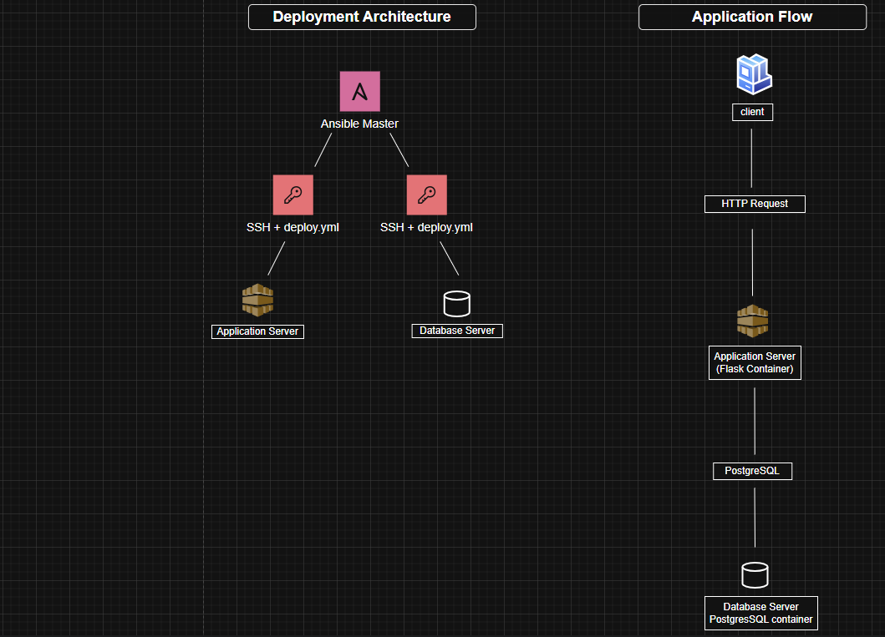

# Docker & Ansible Mini Project

## Deployment Workflow

1. Build Docker images
2. Start containers
3. Configure SSH connectivity
4. Copy deployment files
5. Run Ansible Playbook
6. Deploy Flask Application
7. Deploy PostgreSQL Database
8. Verify services

## Overview
This project demonstrates automated deployment of a Flask application and PostgreSQL database using Docker, Docker Compose and Ansible.

## Components
- Ansible Master
- Ansible Slave App
- Ansible Slave DB
- Flask Application
- PostgreSQL Database
- pgAdmin

## Project Structure

ansible/
ansible-master/
ansible-slave-1/
app/
database/

## Build and Run

Run:

./automation.sh

## Deployment

Enter Ansible Master:

docker exec -it ansible-master bash

Run playbook:

ansible-playbook -i inventory.ini deploy.yml

## Verification

Check containers:

docker ps

Check application:

http://localhost:5000/users/

## Technologies

- Docker
- Docker Compose
- Ansible
- Python Flask
- PostgreSQL
- Linux

## Architecture Diagram
